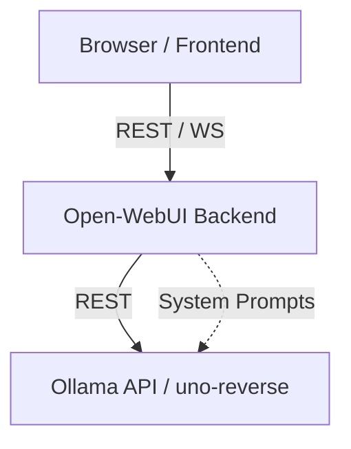

# Ollama & Open-WebUI Communication Flows

This document maps the communication between the Open-WebUI frontend/backend and the Ollama API (or mocks like `uno-reverse`). It serves as a technical reference for maintaining and extending `uno-reverse`.

## High-Level Architecture



1.  **Frontend (TypeScript)**: Initiates chat, model management, and configuration requests.
2.  **Backend (Python)**: Acts as a proxy/adapter. It transforms frontend requests into Ollama-compatible payloads, handles RAG (Retrieval Augmented Generation), and manages session state.
3.  **Ollama / uno-reverse**: Processes the LLM requests. `uno-reverse` intercepts these to allow human operation.

---

## 1. Chat & Generation Flows

### POST `/api/chat` (Standard Ollama)
**Initiator**: `backend/open_webui/routers/ollama.py`
**Description**: Primary endpoint for conversational AI.

**Payload Structure**:
```json
{
  "model": "uno-reverse",
  "messages": [
    { "role": "system", "content": "..." },
    { "role": "user", "content": "Hello!", "images": ["base64..."] }
  ],
  "stream": true,
  "format": "json" (optional),
  "options": { ... }
}
```

**Data Transformations**:
- Open-WebUI backend aggregates conversation history from its database.
- Images are converted to base64 if they were uploaded as files.

**Uno-reverse Support**: ✅ Fully supported. Intercepts `messages` to extract the latest prompt and history.

---

### POST `/v1/chat/completions` (OpenAI Compatibility)
**Initiator**: Frontend (direct or via backend proxy)
**Description**: Used when Open-WebUI is configured to use OpenAI-compatible providers.

**Payload Structure**:
```json
{
  "model": "uno-reverse",
  "messages": [
    {
      "role": "user",
      "content": [
        { "type": "text", "text": "What is in this image?" },
        { "type": "image_url", "image_url": { "url": "data:image/jpeg;base64,..." } }
      ]
    }
  ],
  "stream": true
}
```

**Uno-reverse Support**: ✅ Supported. Normalizes OpenAI format to internal representation.

---

## 2. Embedding & Batch Inference

### POST `/api/embed` (Ollama)
**Initiator**: `backend/open_webui/retrieval/utils.py` -> `generate_ollama_batch_embeddings`
**Description**: Converts text chunks into vector embeddings for RAG.

**Payload Structure**:
```json
{
  "model": "nomic-embed-text",
  "input": ["text chunk 1", "text chunk 2"]
}
```

**Uno-reverse Support**: ❌ Not supported. Currently returns 404.

---

## 3. Web Search (Open-WebUI Extension)

### POST `/api/web_search`
**Initiator**: Open-WebUI Backend
**Description**: A custom endpoint used by Open-WebUI for agentic search. If "Ollama Cloud" or a similar provider is used, it may relay search queries.

**Payload Structure**:
```json
{
  "query": "Who won the World Series in 2024?",
  "count": 5
}
```

**Uno-reverse Support**: ❌ Not supported.

---

## 4. Model & Tag Management

### GET `/api/tags`
**Description**: Fetches available models to populate the model selector in the UI.

**Response**:
```json
{
  "models": [
    {
      "name": "uno-reverse",
      "details": { "family": "llama", "parameter_size": "8B" }
    }
  ]
}
```

**Uno-reverse Support**: ✅ Supported. Returns a static list with the `uno-reverse` model.

---

## 5. Admin & Config

### GET `/api/config` / POST `/api/config/update`
**Description**: Synchronizes Ollama URLs and global settings. Open-WebUI checks for Ollama connectivity periodically.

---

## 6. Attachment & History Handling

### Multi-modal Support
- **Ollama Native**: Images are in the `images` array at the message level.
- **OpenAI Compat**: Images are in the `content` array as `image_url` objects.
- **Internal Handling**: `uno-reverse` should consolidate these into a unified `attachments` list for the operator.

### History Persistence
- Open-WebUI sends the *entire* relevant history in each request to maintain context, as Ollama is stateless.
- `uno-reverse` tracks `chat_id` to maintain its own `chatHistories` map for the operator's convenience, but it should prioritize the history sent in the request body as the "source of truth".

---

## 7. System Prompt Interception (Open-WebUI Meta Tasks)

Open-WebUI often sends "meta" requests to the LLM to perform background tasks like generating a chat title, suggested follow-up questions, or tags. `uno-reverse` identifies these using regex patterns and "wraps" them into specialized system tasks.

### Interception Logic
1.  **Detection**: `server.js` scans incoming prompts/messages for patterns matching `SYSTEM_PROMPT_WRAPPERS` (e.g., "generate a concise title").
2.  **State Management**: Instead of showing these in the main chat, `uno-reverse` marks them as `kind: "wrapped_prompt"`.
3.  **UI Feedback**: The operator panel displays a specific modal for these tasks, allowing for structured input (e.g., a single line for a title).
4.  **Auto-Response**: If `SKIP_SYSTEM_TASKS` is enabled (via environment variable or UI toggle), the server intercepts these requests and immediately returns a default response (e.g., `{"title": "Chat Summary"}`) without notifying the operator.

---

## 8. Gaps & Improvements for uno-reverse

1.  **Embedding Stub**: Implement a basic `/api/embed` that returns random/zero vectors so RAG operations don't fail when `uno-reverse` is the primary backend.
2.  **Web Search Mock**: Implement `/api/web_search` to allow testing of Open-WebUI's agentic features.
3.  **Full History UI**: The control panel currently only shows the latest prompt. It should be updated to show the full `messages` array from the request.
4.  **Image Previews**: The control panel extracts image names but does not display the actual images to the operator.
5.  **Status 501/404**: Better handling of unsupported Ollama endpoints to inform the user why a feature (like image generation or embedding) is failing.
